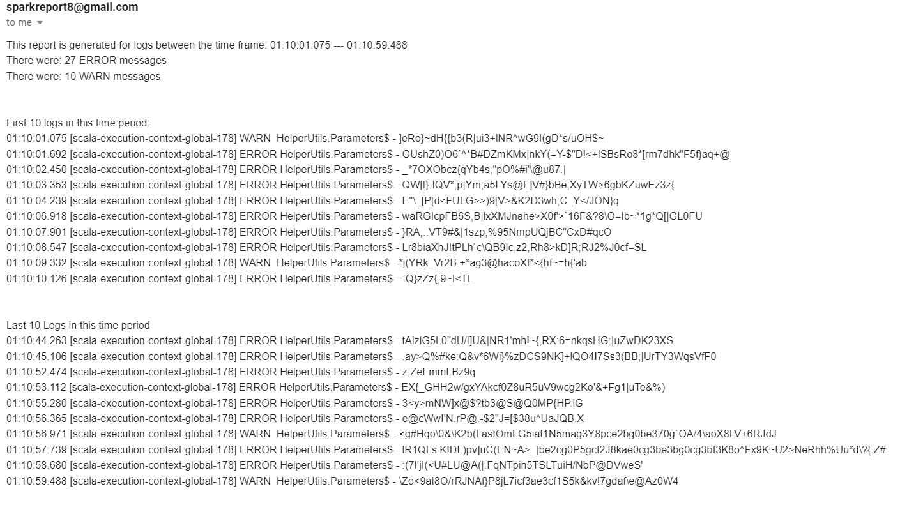

# Course Project
### Aws Deployment Video: https://youtu.be/vj4cN4khn8A

### Team members
+ Sai Nadkarni (snadka2)
+ Ankit Kumar Singh (asing200)
+ Sebastian Greczek (sgrecz3)
+ Sanchita Kapoor (skapoo22)
+ Bhavana Nelakuditi (bnelak3)

# Overview Of Pipeline


Our project is distributed across three EC2 instances. One EC2 #1 we have multiple log generators that write to a root log directory. Next, we have the Watcher program that uses ```Java NIO``` to watch for changes in the log directory. Then, we use ``Akka Actor model``  which checks the log messages that we generate and if there is a greater then 4 ERROR or WARN messages, it sends these messages to the kafka cluster.

On EC2 #2 we have our Kafka cluster deployed. We have ``Zookeeper`` running on this instance that keeps track of a node's status and maintains a list of topics. In our case it is the ``logfilescraper`` topic. We also have our Kafka broker running on this instance where the Watcher program acts as producer and the LogProcessingSpark Program acts a consumer.

On EC2 #3 we have the our Spark program running. Here we have the spark-shell running which provides the spark context that connects to the spark cluster. Next, in the program LogProcessingSpark we create utilize the spark context to process our logs. We count the number ERROR and WARN messages, provide the time frame of the logs, and provide a sample of the first and last messages. This processing is bundled into a report and is sent to ``sparkreport8@gmail.com`` We use ``Javax Mail API`` to the send the email.

Sample spark report:



# How To Run

## Project set up
+ Clone the project or download the repo in a zip format
+ Open a terminal at the root level of the any of the subdirectories
+ To run the test cases (present in the `Watcher` subdirectory only, for ease of execution from one place),

```
cd Watcher
sbt clean compile test
```

+ To run any of the other scala subdirectory programs

```
sbt clean compile run
```

##Kafka
+ Install Kafka 2.8.1 preferably and unpack it in any directory on your system.
+ For Windows,
```
cd <kafkadir>
bin\windows\zookeeper-server-start.bat config\zookeeper.properties
```
Seperate terminal window,
```
bin\windows\kafka-server-start.bat config\server.properties
```
Seperate terminal window,
```
bin\windows\kafka-topics.bat --create --topic logfilescraper --bootstrap-server localhost:9092
```
+ For Linux,
```
cd <kafkadir>
bin/zookeeper-server-start.sh config\zookeeper.properties
```
Seperate terminal window,
```
bin/kafka-server-start.sh config\server.properties
```
Seperate terminal window,
```
bin/kafka-topics.sh --create --topic logfilescraper --bootstrap-server localhost:9092
```

## Log Generator and Watcher
+ Simply running `sbt clean compile run` after kafka is initialized will start these programs up. 

## Spark
+ Install Spark for Windows using [this guide](https://phoenixnap.com/kb/install-spark-on-windows-10). For linux, just downloading and unpacking the tgz file will get you running if you have scala and java installed.
+ Navigate to bin folder inside the downloaded spark installation.
+ Run `spark-shell` to get the spark shell and consecutively, the spark context running.

## LogProcessingSpark
+ Simply running `sbt clean compile run` after spark shell and kafka are initialized will get this program ready
