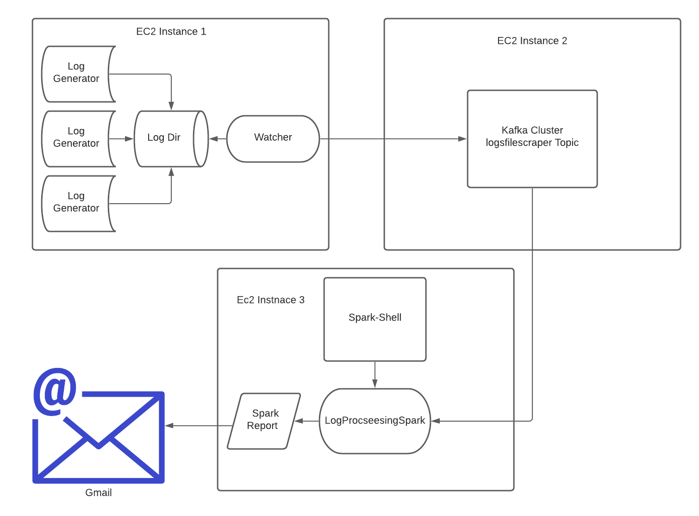

# Course Project
### Aws Deployment Video: https://youtu.be/vj4cN4khn8A

### Team members
+ Sai Nadkarni (snadka2)
+ Ankit Kumar Singh (asing200)
+ Sebastian Greczek (sgrecz3)
+ Sanchita Kapoor (skapoo22)
+ Bhavana Nelakuditi (bnelak3)

# Overview Of Pipeline



Our project is distributed across three EC2 instances. One EC2 #1 we have multiple log generators that write to a root log directory. Next, we have the Watcher program that uses ```Java NIO``` to watch for changes in the log directory. Then, we use ``Akka Actor model``  which checks the log messages that we generate and if there is a greater then 4 ERROR or WARN messages, it sends these messages to the kafka cluster.

On EC2 #2 we have our Kafka cluster deployed. We have ``Zookeeper`` running on this instance that keeps track of a node's status and maintains a list of topics. In our case it is the ``logfilescraper`` topic. We also have our Kafka broker running on this instance where the Watcher program acts as producer and the LogProcessingSpark Program acts a consumer.

On EC2 #3 we have the our Spark program running. Here we have the spark-shell running which provides the spark context that connects to the spark cluster. Next, in the program LogProcessingSpark we create utilize the spark context to process our logs. We count the number ERROR and WARN messages, provide the time frame of the logs, and provide a sample of the first and last messages. This processing is bundled into a report and is sent to ``sparkreport8@gmail.com`` We use ``Javax Mail API`` to the send the email.

Sample spark report:


# How To Run

## Log Generator and Watcher
## Kafka 
## Spark
## LogProcessingSpark
